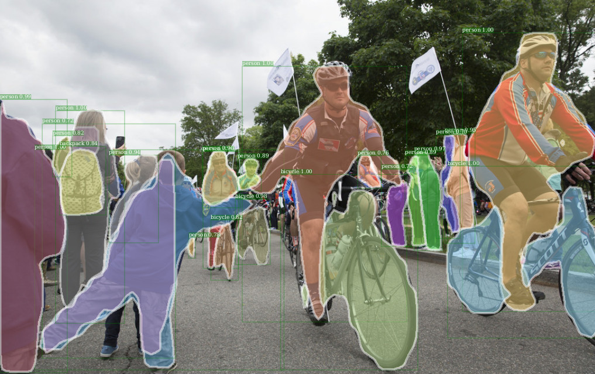

# Detectorch  - detectron for PyTorch

(Disclaimer: this is work in progress and does not feature all the functionalities of detectron. Currently only inference and evaluation are supported -- no training)


This code allows to use some of the [Detectron models for object detection from Facebook AI Research](https://github.com/facebookresearch/Detectron/) with PyTorch.

It currently supports:

- Fast R-CNN
- Faster R-CNN
- Mask R-CNN

The only tested base network model so far is ResNet-50 (no FPN for the moment). The pre-trained models from caffe2 can be imported and used on PyTorch.

<div align="center">
  
  <p>Example Mask R-CNN with ResNet-50.</p>
</div>

## Evaluation
Both bounding box evaluation and instance segmentation evaluation where tested, yielding the same results as in the Detectron caffe2 models.

## Training
No training was tested. The losses are not yet implemented. Please contribute!

## Installation
First, clone the repo with `git clone --recursive https://github.com/ignacio-rocco/detectorch` so that you also clone the Coco API.

The code can be used with PyTorch 0.3.1 or PyTorch 0.4 (master) under Python 3. Anaconda is recommended. Other required packages

- torchvision (`conda install torchvision -c soumith`)
- opencv (`conda install -c conda-forge opencv `)
- cython (`conda install cython`)
- matplotlib (`conda install matplotlib`)
- scikit-image (`conda install scikit-image`)

Additionally, you need to build the Coco API and RoIAlign layer. See below.

#### Compiling the Coco API
If you cloned this repo with `git clone --recursive` you should have also cloned the cocoapi in `lib/cocoapi`. Compile this with:
```
cd lib/cocoapi/PythonAPI
make install
```


#### Compiling RoIAlign
The RoIAlign layer was converted from the caffe2 version. There are two different implementations for each PyTorch version:

- Pytorch 0.4: RoIAlign using ATen library (lib/cppcuda). Compiled JIT when loaded.
- PyTorch 0.3.1: RoIAlign using TH/THC and cffi (lib/cppcuda_cffi). Needs to be compiled with:

``` 
cd lib/cppcuda_cffi
./make.sh 
```

## Quick Start
Check the demo notebook. 
